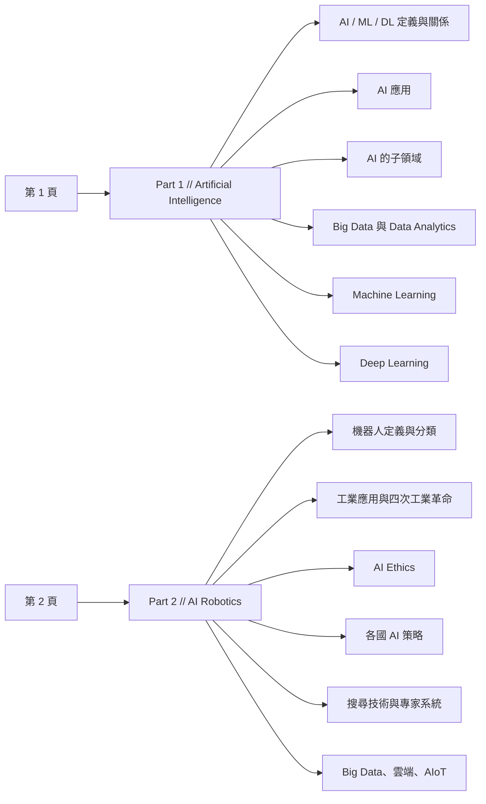

我 Year 1 修的 COMP1004，現在課號改成 **DSAI1202**，課名沒變：Introduction to Artificial Intelligence and Data Analytics。如果你是搜課號找進來的，這兩個代號指的是同一科。

期末的 Final Quiz 以選擇題為主，可以帶 cheat sheet 進場。我照 lecture slides 壓了一張兩頁的紙進去，這科最後拿 A-。

檔案放在 GitHub，可以直接下載：**[COMP1004-FinalCheatSheet](https://github.com/Joe4NYC/COMP1004-FinalCheatSheet)**（PDF，兩頁）。

下面列出這張紙的骨架，讓你不用先下載也知道裡面有沒有你要的東西。

<!-- more -->

## 先說清楚：這是 2024 年的版本

我修這科是 **2024 年**，這張紙完全照當年的 lecture slides 整理。

課號從 COMP1004 換成 DSAI1202，通常也代表課程大綱動過。加上 AI 這個題目本身更新得特別快——紙上那條 AI Milestones 就停在 2023 年的 ChatGPT-4，之後兩年發生的事一件都沒有。

所以請把它當**參考**，不是當答案。拿去跟你自己那年的 slides 對一遍，多出來的補上，不教了的劃掉。

## 兩頁的骨架

紙分成兩大部分，順序跟當年的課程走：

Part 2 其實從第一頁的末尾就開始了（機器人定義和 AI Milestones 卡在第一頁最後），版面是排滿為止，不是一頁一個 Part。

## 第一頁：AI 與資料分析

**AI / ML / DL**
三者的定義各配一個例子（Siri、Netflix 推薦、ChatGPT），後面接三層的包含關係：AI 包住 ML，ML 包住 DL。

**AI 應用**

- 疾病偵測與癌症診斷
- AlphaFold 與蛋白質結構
- 香港的智慧醫院：中大醫療中心、天水圍醫院（2017）
- 自駕車 L0–L5 六個等級，每級一句話（例子是百度 Apollo Go，2022，L4）

**AI 的子領域**

- Computer Vision：image segmentation、Meta 的 SAM2
- NLP：speech recognition（Whisper）、speech synthesis（ElevenLabs）
- Face Detection / Face Analysis / Face Recognition 三個詞的分工
- 職場技能那一小段：T 型與 M 型人才

**Big Data 與 Data Analytics**

- Big Data 的 4V
- 結構化 / 半結構化 / 非結構化三種資料型態，各配例子
- 四種 data analytics：Descriptive、Diagnostic、Predictive、Prescriptive

**Machine Learning**

- 早期 AI：Eliza（規則式）、專家系統
- 監督式學習：classification 的三個典型應用（垃圾郵件、情感分析、影像辨識）
- 二元 vs 多元分類（表格）
- Underfitting 與 Overfitting，各配一個考試比喻
- AI 寫作偵測器的 false positive 問題
- Confusion matrix
- Regression：預測數值
- 非監督式學習、強化學習（AlphaGo、機器人停車）

**Deep Learning**

- 傳統 ML vs DL 的四維度對照（表格）
- 「deep」指的是層數多
- MNIST、全連接前饋網路、CNN（影像）、Transformer（NLP，生成式 AI 的基礎）
- Keypoint detection、pose estimation、義肢

**Part 2 的開頭**（卡在第一頁末）

- 機器人的定義（robota，僕役）與四個關鍵特徵：感知、移動、能源、智慧
- AI Milestones 2014–2023：GANs、Sophia、WaveNet、AlphaGo、Deepfakes、Transformer、GPT-1、AlphaFold、生成式 AI 普及、ChatGPT-4

## 第二頁：機器人、倫理與政策

**機器人分類**

- JIRA（日本產業機器人協會）六分類
- RIA（美國機器人協會）Type A 到 Type D

**應用與優劣**

- 五類應用：人形、工業、醫療、服務、國防
- 優點與限制各三到四條
- Elon Musk 談 Optimus 的四個重點

**工業製造**

- 四次工業革命：1784 蒸汽、1913 量產、1969 PLC、2014 智慧製造
- 智慧製造循環：Data → Analytics → Action → Control → Product
- 業界典型機器人應用清單（弧焊、堆疊、壓鑄、沖壓、打磨拋光、噴塗、包裝……）

**AI Ethics**

- AI 成功的三個要素：演算法與架構、算力、大數據
- 電腦擅長什麼 vs 人類擅長什麼
- Normal Accidents 與 AI 安全
- AI 的好處與風險對照
- 德國自駕倫理委員會找了哪五種人
- 倫理理論分布：效益主義 30%、權利 12%、康德義務論 10%
- 十二條 AI 倫理原則（Accountability 到 Sustainability）
- ISO/IEC 4200 與 AIMS，以及它的八項好處

**各國 AI 策略**

- 美國、日本（Society 5.0）、歐盟、中國各自的重心
- 中國 AI 發展計畫的 2020 / 2025 / 2030 三個階段

**搜尋與知識表示**

- Knowledge Graph
- 盲目搜尋（DFS、BFS）、啟發式搜尋（A*）、局部搜尋（Hill-Climbing）、對抗搜尋（Alpha-Beta 剪枝、蒙地卡羅樹搜尋）
- 專家系統（Edward Feigenbaum，1982）
- Generative AI = 創造、NLP = 理解、LLM = 進階 NLP

**Big Data、雲端與 AIoT**

- Data / Dataset / Big Data 三個詞的分別
- 雲端運算的五大特性
- AIoT 的組成要素

## 紙上做成表格的部分

這幾組是成對或成組出現的概念，我在紙上排成了表格：

- Binary vs Multiclass classification
- Underfitting vs Overfitting
- 傳統 ML vs Deep Learning（特徵萃取、訓練資料量、算力、可解釋性四個維度）
- 電腦擅長什麼 vs 人類擅長什麼
- AI 的好處 vs AI 的風險

## 紙上的固定清單

有編號、有年份、有固定條數的東西佔了不少版面，整理成一張表方便你對照自己的 slides：

| 清單 | 內容 |
| --- | --- |
| Big Data 的 4V | Volume、Velocity、Variety、Veracity |
| 四種 Data Analytics | Descriptive（發生了什麼）、Diagnostic（為什麼）、Predictive（將會怎樣）、Prescriptive（該怎麼做） |
| 三種資料型態 | 結構化（表格）、半結構化（email、HTML）、非結構化（影音、圖片） |
| 自駕車 L0–L5 | 從無自動化到全自動，L3 是「車全包但人要能介入」那條界線 |
| 機器人四特徵 | 感知、移動、能源、智慧 |
| JIRA 機器人六分類 | 手動操作、固定順序、可變順序、Playback、數值控制、智慧型 |
| RIA 機器人四型 | Type A 到 Type D，D 多了從環境取得資訊的能力 |
| 四次工業革命 | 1784 蒸汽、1913 量產、1969 PLC、2014 智慧製造 |
| 智慧製造循環 | Data → Analytics → Action → Control → Product |
| 十二條 AI 倫理原則 | 從 Accountability 到 Sustainability |
| 雲端五大特性 | 彈性擴縮、更快上市、零初期投資、用多少付多少、專注本業 |
| 各國 AI 策略 | 美國拚經濟與國安、日本 Society 5.0、歐盟重倫理風險、中國推產業化 |
| 中國 AI 三階段 | 2020 追上、2025 重大突破、2030 成為全球創新中心 |

## 幾個提醒

**找資料時兩個課號都要搜。** COMP1004 和 DSAI1202 是同一科，只搜新代號會漏掉大部分舊資料。

**內容是 2024 年的。** 上面已經說過一次，但值得再講：拿去對照你自己那年的 slides，不要直接當答案卷。

**能不能帶進場，以你當年的公告為準。** 我那年是可以的，但這種規定會改，開考前自己確認一次。

祝考試順利。
