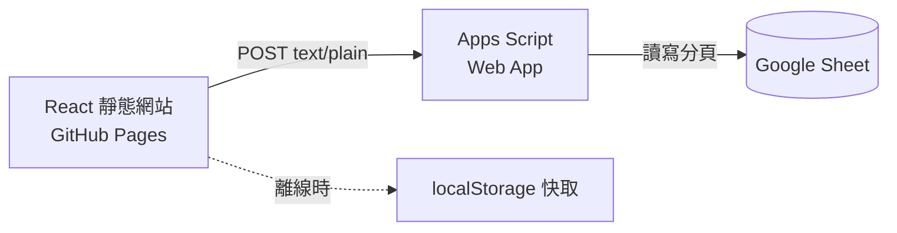

我一直用一張 Google Sheet 記帳，痛點很單純：輸入麻煩、圖表醜。我想要一個能一眼看懂趨勢的介面，但完全不想為了一個自己用的小工具去養一台伺服器——要付費、要更新、要監控，還要備份一份跟 Sheet 一模一樣的資料。

於是後端就是那張 Sheet 本身。前端是一個純靜態網站丟在 GitHub Pages，中間夾一個 Google Apps Script Web App 當 API。零伺服器、零資料庫、零月費，資料還是躺在我自己的 Google 帳號底下。這篇記錄實作過程中三個真正花掉時間的地方。

<!-- more -->

## 整個資料流長這樣



前端沒有任何秘密，任何人打開網址都只會看到一個「連接你的 Google Sheet」畫面。網址和密鑰存在瀏覽器，資料進出都經過那個 Apps Script 端點。

## 繞過 CORS 預檢：用 text/plain 送 JSON

第一個坑。正常你會想用 `Content-Type: application/json` 送 POST，但那會觸發瀏覽器的 CORS 預檢（preflight），而 Apps Script 的 Web App 對 `OPTIONS` 請求的處理很難搞，常常直接失敗。

解法是把 body 當成純文字送：

```ts
await fetch(cfg.url, {
  method: "POST",
  headers: { "Content-Type": "text/plain;charset=utf-8" },
  body: JSON.stringify({ token: cfg.token, action: "save", data }),
});
```

`text/plain` 是 CORS 的「簡單請求」之一，不會觸發預檢。伺服器那邊照樣 `JSON.parse(e.postData.contents)` 就拿到物件。內容明明是 JSON，只是騙瀏覽器說它是純文字——這招在 Apps Script 幾乎是標配。

## 兩部裝置同時改：樂觀鎖

同步一開始是最笨的做法：每次資料變動，就把整份 JSON 覆蓋寫回 Sheet。單機沒問題，但只要我在手機和電腦同時開著，後存的一方會把先存的改動整份蓋掉，而且完全無聲無息。

修法是加一個版本戳。Apps Script 用 `ScriptProperties` 存一個 `updatedAt`，前端每次載入都記住它；存檔時把「我這份是基於哪個版本」一起送上去：

```js
const stored = getUpdatedAt();
if (!body.force && body.baseUpdatedAt && stored && body.baseUpdatedAt !== stored) {
  return json({ ok: false, error: "conflict" });   // 雲端比較新，先不要蓋
}
writeAll(body.data);
setUpdatedAt(new Date().toISOString());
```

外層再包一個 `LockService` 的腳本鎖，避免兩個請求同時進到寫入區。前端收到 `conflict` 就不硬存，改彈一條橫幅讓我自己決定：載入雲端版本，還是以這邊覆蓋。

這是樂觀鎖（optimistic locking）最精簡的樣子——不預先鎖，等衝突發生才處理。對一個使用者頂多開兩三個分頁的場景，這樣剛剛好，不用扯到什麼版本向量。

## 淨資產走勢：每天一行快照

資產在資料模型裡只是「當前值」，沒有時間維度，所以畫不出走勢。理財 App 最想看的那張「淨資產有沒有在往上」的圖，反而是缺的。

解法是在存檔時，順手把當天的總資產、淨資產寫進一個獨立分頁，一天只留一行：

```js
const today = toDateStr(new Date());
const existing = rows(sheet).findIndex((r) => toDateStr(r[0]) === today);
if (existing === -1) sheet.appendRow([today, total, net]);   // 今天還沒有 → 新增
else sheet.getRange(existing + 2, 1, 1, 3).setValues([[today, total, net]]); // 有 → 覆蓋
```

計算交給前端、只把算好的數字送上來，這樣「淨資產 = 總資產 − 借貸」這條公式只活在一個地方。累積幾天之後，儀表板那條迷你走勢圖就從「拿收支累計來湊」換成真實的資產曲線。

## 讓舊後端也不會壞

上面兩個功能都要改 Apps Script，而重新部署是手動的——我很可能哪天先更新了前端、卻忘了貼新的後端。所以前端對新欄位一律採取「沒有就當空的」：

```ts
const snapshots = out.snapshots || [];              // 舊後端沒回這欄 → 空陣列
return { data: out.data, snapshots, updatedAt: out.updatedAt ?? null };
```

版本戳是 `null` 時，衝突判斷的 `stored && body.baseUpdatedAt` 直接短路，等於自動退回「無保護」的舊行為。新前端配舊後端，功能少一點但不會爆。這種向後相容不用寫什麼相容層，把「缺值」當成合法輸入處理就好。

整個東西加起來大概兩百行，沒有資料庫、沒有伺服器帳單。對一個自己每天打開兩分鐘的工具來說，這個成本結構才是重點。

後來我把同一套「Sheet 當後端」的做法搬去做訂閱追蹤器 SubLens，也順便踩到另一組完全不同的問題——[為 SubLens 加上 Demo 模式](/blog/sublens-demo%E6%A8%A1%E5%BC%8F_20260908/)。
