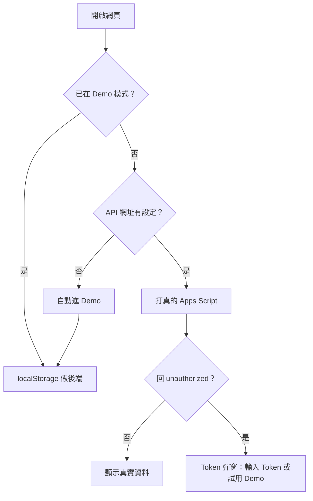

SubLens 是我自己用的訂閱追蹤器，資料存在自己的 Google Sheet 上（這套把 Sheet 當後端的架構，我在[另一篇](/blog/googlesheet%E7%95%B6%E7%90%86%E8%B2%A1app%E5%BE%8C%E7%AB%AF_20260908/)寫過怎麼搭）。這個設計對我很好，對第一次點進來的人很糟：網頁一開就跳出「請輸入 API Token」，而他根本還不知道這東西能幹嘛。

這篇記錄怎麼加一個 Demo 模式讓陌生人先看到東西，以及三個當下沒想到、跑起來才發現的問題。

<!-- more -->

## 唯一的設計決定：攔在哪一層

程式碼拆成九個模組，但所有跟後端講話的地方都收斂在 `api.js` 的同一個函式。新增、編輯、暫停、封存、刪除、讀匯率，全部走這裡。

所以假後端只要塞在這個函式的最前面，其他八個檔案一行都不用改：

```js
export async function apiFetch(action, data = null) {
  spinnerDepth++;
  document.getElementById('apiSpinner').classList.remove('hidden');
  try {
    // Demo 模式：改由本機 localStorage 模擬，不發出網路請求
    if (isDemoMode()) {
      const result = await demoFetch(action, data);
      if (result && result.error) throw new Error(result.error);
      return result;
    }
    // ...以下是原本的 fetch，完全沒動
```

前提是 `demoFetch()` 的**回傳形狀要跟 Apps Script 一模一樣**：讀取回陣列，寫入回 `{ success: true }`，出錯回 `{ error: "..." }`。

呼叫端本來就有這種判斷：

```js
const result = await apiFetch('updateSubscription', data);
if (result === null) return;
```

形狀對了，這行就繼續有效，不用為 demo 多開一條分支。假後端本體是一個 switch，讀寫 localStorage：

```js
case 'updateSubscription': {
  const idx = subs.findIndex(s => String(s.id) === String(data.id));
  if (idx === -1) return { error: '找不到 id 為 ' + data.id + ' 的資料列' };
  subs[idx] = { ...subs[idx], ...data };
  saveStore(subs);
  return { success: true };
}
```

連錯誤訊息都照抄後端原文。不是為了好玩——訊息不一樣的話，之後看到報錯會分不出是哪一邊噴的。

## 種子資料不能寫死日期

第一版我把範例訂閱的 `startDate` 直接寫成 `"2026-03-15"` 這種固定字串。當下看起來完全正常。

問題是這個 app 的三個主要數字——下次扣費日、累積支出、趨勢圖——全部是拿今天跟 `startDate` 算出來的。固定日期的種子資料放三個月就會爛掉：累積支出愈滾愈大，圖表看起來像鬼。而且它不會報錯，只會愈來愈不合理。

改成相對今天生成：

```js
function daysAgo(n) {
  const d = new Date();
  d.setDate(d.getDate() - n);
  return d.toISOString().split('T')[0];
}

{ name: 'Netflix',         startDate: daysAgo(420), status: 'active' },
{ name: 'YouTube Premium', startDate: daysAgo(90),  status: 'paused',   pausedDate: daysAgo(20) },
{ name: 'Adobe CC',        startDate: daysAgo(700), status: 'archived', endDate: daysAgo(60) },
```

七筆資料刻意鋪滿所有狀態組合：三種貨幣、月費跟年費、`active` / `paused` / `archived` 各有代表。demo 的用途就是讓人看到功能存在，少一種狀態就少展示一個功能。

## 坑一：入口放在使用者看不到的地方

第一版的入口是頁面頂部一條橫幅，寫著「未設定 Google Sheets？試用 Demo」。

跑起來才發現新用戶根本看不到它。實際流程是：頁面載入 → 第一個請求回 `unauthorized` → token 彈窗蓋住整頁。橫幅在彈窗底下。

所以入口要放進彈窗本身：

```html
<div class="mt-4 pt-4 border-t border-gray-100 dark:border-gray-700 text-center">
  <p class="text-xs text-gray-400 mb-2">沒有 Token？</p>
  <button id="btnTokenDemo" class="w-full border ...">🧪 試用 Demo 模式</button>
</div>
```

橫幅留著，但它服務的是另一種人：已經在用、想看看 demo 長怎樣的。真正的新用戶入口是那個彈窗。

事後看很明顯。但寫的時候我腦裡的畫面是「乾淨的首頁」，不是「被彈窗蓋住的首頁」。

## 坑二：改了狀態，卻沒有人去重新拉資料

存完 Token 之後，畫面是空的。

原本的 handler 長這樣：

```js
localStorage.setItem('sublens_token', token);
showToast('Token 已儲存', 'success');
hideModal('tokenModalOverlay');
```

寫進去了、彈窗關了，然後就沒了。`loadData()` 在啟動時已經跑完，沒有人會再叫它第二次。清除 Token 一模一樣的問題。

修法是三個動作統一 reload：

```js
localStorage.setItem('sublens_token', token);
localStorage.removeItem('sublens_demo'); // 從 Demo 切回真實帳戶
showToast('Token 已儲存，重新載入中…', 'success');
hideModal('tokenModalOverlay');
location.reload();
```

`location.reload()` 很粗暴，但這裡它是對的答案。改 token、進 demo、退 demo，三件事都是換資料來源，等於整個 app 的狀態全部作廢。手動重跑 `loadData()` 加 `loadAndDisplayRates()` 再重畫兩張圖，要記得清的東西比 reload 多，而使用者一年大概會按到這幾顆按鈕三次。

`removeItem('sublens_demo')` 那行是後來補的。少了它，一個在 demo 模式的人輸入真 Token 之後，會存好 token、reload、然後繼續看到假資料，完全不知道發生什麼事。

## 坑三：自動判斷放太晚

沒填 API 網址的人（例如 fork 這個 repo 的人）應該直接進 demo，不用自己點。判斷本身很簡單：

```js
export function isApiConfigured() {
  const url = CONFIG.API_URL || '';
  return url.startsWith('https://script.google.com/macros/s/') &&
         !url.includes('YOUR_DEPLOYMENT_ID');
}
```

我一開始把它放在 `loadData()` 開頭。邏輯上沒錯，時序上錯了——init 是這樣跑的：

```js
await loadAndDisplayRates();  // 先跑，對著空網址發請求，噴紅色錯誤
await loadData();             // 才發現沒設定，進 demo，reload
```

使用者會先吃到一個錯誤 toast，畫面才閃一下重整。判斷要移到 `init()` 第一行，在任何請求發出去之前：

```js
async function init() {
  if (!isDemoMode() && !isApiConfigured()) {
    enterDemoMode(); // reloads the page
    return;
  }
  ...
}
```

這類 bug 的共通形狀是：把檢查放在「用到那個東西的函式」裡，而不是「最早能知道答案的地方」。

## 最後的樣子



## 刻意不做的事

**沒做 demo 資料匯出，也沒做 demo 搬到真實帳戶。** 想像中很順（「試用完把資料帶走」），實際上沒有人想留著七筆假訂閱。做了就要處理 id 衝突、匯率換算、部分失敗要不要回滾，為一個沒人走的路徑多養三個錯誤狀態。

**demo 資料沒有版本或遷移機制。** 之後欄位改了，舊的 demo 資料可能對不上。到時候的處理方式是叫使用者按「重設資料」——反正是假的，重來的成本是零。

---

回頭看，這件事實作上最省力的部分是攔截點：因為所有請求本來就收斂在一個函式，假後端才能只寫一個新檔案接上去。如果當初每個模組各自 `fetch`，同樣的功能要改八個地方，而且一定會漏掉一兩個。

模組化的好處通常被講成「好讀」「好測試」，這次它換到的是一個更具體的東西：加一整套平行的資料來源，`api.js` 的 diff 只有一個 `if`。
