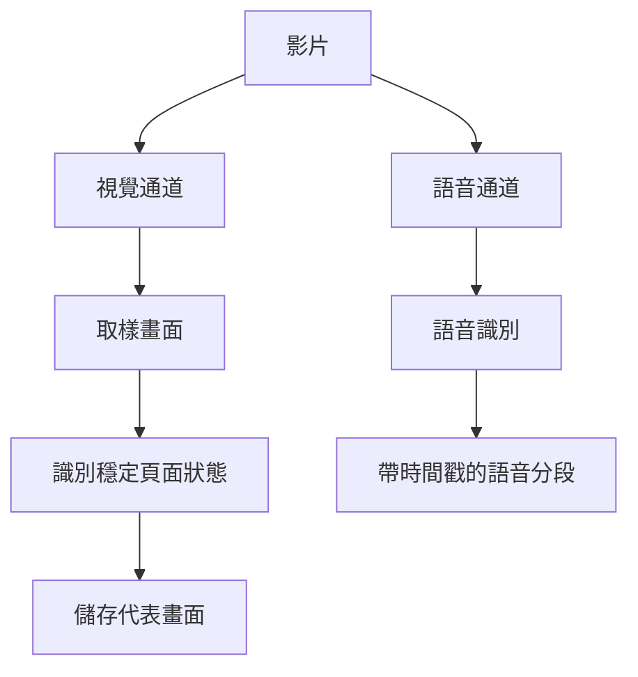

這不是一篇需要從頭讀到尾的教程，而是一間專門為 **ulBo** 準備的 Markdown 陳列室。你可以快速滾動頁面，檢視排版節奏、目錄跟隨、程式碼高亮、圖片懶載入，以及不同內容元素在明暗主題下的表現。

<!-- more -->


## 從一段普通正文開始

好的閱讀體驗通常並不張揚。它讓正文保持舒適的行寬，讓段落之間擁有足夠的呼吸，也讓連結、強調和註釋自然地融入句子。比如，你可以訪問 [Astro 官方網站](https://astro.build/)，也可以使用 **粗體強調重點**、*斜體表達語氣*，或者用 `行內程式碼` 標記檔名和命令。

中文與 English、數字 2026、符號 `@astrojs/mdx` 混排時，文字仍然應該保持穩定、清晰。較長的段落則用來觀察行高與換行：設計不是把所有東西裝飾得更複雜，而是幫助讀者在內容之間建立層次，在需要停頓的地方停頓，在需要繼續的地方自然前進。

> 一個好的主題不應該搶走文章的注意力。
> 它更像安靜的展廳：負責光線、距離與方向，把舞台留給內容本身。

### 文本細節

下面集中展示常見的行內語義：

- **這是粗體文字**，適合結論與關鍵詞。
- *這是斜體文字*，適合語氣與作品名稱。
- ~~這是刪除線~~，適合展示修訂前的想法。
- `const theme = 'ulBo'` 是一段行內程式碼。
- [這是一個外部連結](https://docs.astro.build/)，用於觀察懸停與訪問狀態。

---

## 列表與資訊層級

列表是長文章裡最常見的結構之一。無序列表適合並列資訊：

- 清晰的內容層級
- 舒適的閱讀寬度
- 穩定的目錄定位
  - 二級專案也應該容易辨認
  - 縮排不應破壞正文節奏
- 對移動端友好的互動

有序列表則更適合說明步驟：

1. 寫下文章最重要的結論。
2. 用標題建立清晰的章節。
3. 新增圖片、程式碼或資料作為證據。
4. 最後再檢查移動端的閱讀體驗。

任務清單可以展示完成狀態：

- [X] 準備文章結構
- [X] 新增原創演示圖片
- [X] 覆蓋主要 Markdown 樣式
- [ ] 寫下屬於你的下一篇文章

## 圖片與長頁面節奏

圖片不只負責裝飾，它還會改變長頁面的滾動節奏。下面這張圖放在文章中段，可以用來觀察圖片圓角、最大寬度、懶載入佔位，以及載入完成後目錄錨點是否仍然穩定。


下面是一張 9:16 的豎向圖片，用於觀察文章頁在桌面與移動端的等比縮放效果；點選圖片可檢視燈箱中的完整尺寸。


### 為什麼圖片尺寸很重要

瀏覽器在圖片下載前就知道其寬高時，可以提前留出正確空間，減少內容突然跳動。本站的 Markdown 圖片處理會補充尺寸資訊，並使用懶載入來平衡首屏速度與滾動體驗。

> **提示**：測試目錄定位時，可以點選後面的“程式碼展示”或“數學公式”章節，再快速向上、向下滾動，觀察高亮狀態與最終停靠位置。

## 程式碼展示

行內程式碼適合短小內容，例如 `npm run dev`。完整程式碼塊則用於展示語法高亮、橫向滾動和長行換行。

```ts
type Post = {
  title: string;
  description: string;
  tags: string[];
};

const featuredPost: Post = {
  title: 'Designing a calm reading experience',
  description: 'Content first, decoration second.',
  tags: ['Astro', 'Design', 'Markdown'],
};

export const formatTitle = ({ title }: Post) =>
  `${title} — ulBo`;
```

也可以展示命令列內容：

```bash
npm install
npm run dev
npm run build
```

以及一行比較長的程式碼，用於檢查窄屏裝置上的處理方式：

```js
const message = posts.filter((post) => post.data.tags.includes('Astro')).map((post) => post.data.title).join(' · ');
```

## 表格展示

表格適合承載需要橫向比較的資訊。在手機上，它應當保持可讀，而不是把整個頁面撐寬。

| 元素       | 用途                 | 本文位置 |
| :--------- | :------------------- | -------: |
| 標題與目錄 | 建立閱讀路徑         |     多處 |
| 圖片       | 展示視覺內容與懶載入 |     2 張 |
| 程式碼塊     | 展示語法高亮         |     3 組 |
| 表格       | 對比結構化資訊       |     2 組 |
| 數學公式   | 技術文章排版         |     2 組 |

### 手機端寬表滾動示例

下面這張四列表格故意保留較多資訊，用來檢查手機端的橫向滑動、完整內容展示和閱讀高度。窄屏裝置上可以在表格區域內左右滑動，頁面本身不會被撐寬。

| 工具 | 接收什麼 | 返回什麼 | 在流程中的作用 |
| :--- | :--- | :--- | :--- |
| `explore_data` | `\\tables`、`\\schema <表名>` 或只讀 SQL | 表清單、欄位與樣例、查詢總行數和結果行 | 找到候選表，並用真實資料驗證欄位、過濾、去重、Join 與聚合口徑 |
| `read_solver` | 讀取位置和行數 | 帶“行號 + 行 hash”的 `solver.py` 內容 | 看清腳手架查詢區，並取得安全編輯所需的定位資訊 |
| `edit_solver` | 起止行號、行 hash 和新內容 | 編輯摘要及修改後附近的新 hash | 把口徑註釋和 SQL 寫入唯一允許修改的腳本，語法錯誤時拒絕落盤 |
| `run_solver` | 自檢開關、展示行數和超時 | `FAILED`、`NO OUTPUT` 或 `OK`，以及 CSV 自檢 | 執行最終腳本，並把執行錯誤或結果形態反饋給 Solver |

## 數學公式

行內公式可以自然嵌入句子，例如圓的面積是 $A = \pi r^2$，而獨立公式適合展示更完整的推導：

$$
\operatorname{softmax}(x_i) = \frac{e^{x_i}}{\sum_{j=1}^{n} e^{x_j}}
$$

再看一個經典的尤拉恆等式：

$$
e^{i\pi} + 1 = 0
$$

## 更深的標題層級

這一節專門用於觀察目錄縮排與標題間距。

### 三級標題：元件之間的關係

正文、圖片和程式碼塊並不是彼此獨立的孤島。它們共同決定文章的視覺密度，也會影響讀者滾動頁面時的節奏。

#### 四級標題：一個更細的註釋

實際文章不必頻繁使用很深的標題層級，但主題仍然應該為它們提供清晰、剋制的視覺區別。

### 三級標題：響應式閱讀

在桌面端，目錄可以幫助快速跳轉；在移動端，更重要的是內容寬度、觸控區域和不會溢位的程式碼與表格。

## Mermaid 圖表

使用 Office Viewer 同樣的標準程式碼圍欄即可線上渲染 Mermaid v11 圖表；圖表會自動適配部落格的明暗主題。


### 縱向流程圖（列印示例）

下面這張圖用於展示縱向流程圖在網頁與 PDF 中的自適應尺寸：



## 摺疊內容與補充說明

原生 HTML 也可以和 Markdown 一起使用：

<details>
  <summary>點選展開一段補充內容</summary>

  這段文字預設被摺疊，可以用來存放答案、補充資料或不影響主線閱讀的資訊。

</details>

> [!NOTE]
> 如果你的 Markdown 工具鏈沒有啟用 GitHub 風格警告框，它會優雅地退化為普通引用塊，這同樣可以驗證相容樣式。

## 結語

現在，這篇文章已經覆蓋了 ulBo 文章頁最常用的內容類型。你可以把它保留為主題 Demo，也可以在以後修改樣式時把它當作視覺迴歸測試頁面。

如果標題、段落、列表、引用、圖片、程式碼、表格和公式在明暗主題與不同螢幕寬度下都能保持協調，那麼這個主題就已經為真正的內容做好了準備。
