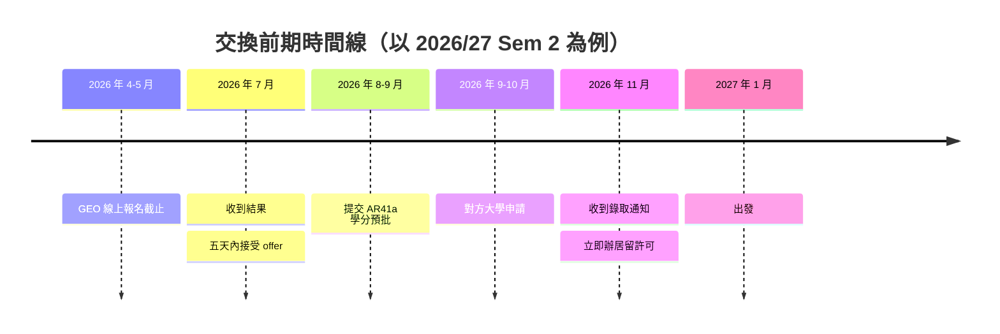

我在準備 2026/27 Semester 2 到瑞典 Linköping University 交換的時候，發現一件事：網上關於 PolyU 交換的中文資料，幾乎都停在「我玩得很開心」那一層。真正會卡住你的東西——AR41a 怎麼填、學分怎麼對應、對方大學的先修要求會不會擋你——一個字都查不到。

這篇把出發前的流程完整走一遍，包括我自己判斷錯的地方。

<!-- more -->

## 整條時間線長什麼樣

以春季學期（PolyU Semester 2）交換為例，實際跨度接近十個月：

看起來很寬鬆，但中間有兩段會突然變緊：接受 offer 只有幾天，以及收到錄取通知到出發只有兩個多月，而簽證要在這段時間內辦完。

## 第一階段：GEO 報名與接受 offer

PolyU 的交換名額有兩條路——透過自己的 Faculty/School/Department，或者透過 GEO（Global Engagement Office）。兩條路的時間表和名額完全不同，可以同時申請。

GEO 這條路的時間表大致是：4 月開放線上報名、5 月中截止、5 月面試（如適用）、6 月中第一輪結果、7 月中第二輪結果。

**接受 offer 的時間比你想像中短。** 我 7 月 16 日收到結果，接受期限是 7 月 21 日 23:59，中間只有五天。而且信裡寫明：只會給你一個 offer，拒絕或不回覆就當放棄，名額直接給下一位。

所以真正要在報名之前就想清楚的是：

- 目標學校的學期日期會不會撞到 PolyU 下一個學期的開學
- 那間學校有沒有你能修、而且能轉學分的課
- 你的 CGPA 有沒有達到對方要求（GEO 一般期望 2.75，部分學校更高）

接受 offer 之後，GEO 才會把你 nominate 給對方學校。**Nomination 不等於錄取**——你還要自己向對方學校遞交一份完整申請，由他們決定收不收。

## 第二階段：AR41a 學分轉移預批

這是整個流程裡最少人講、但最容易出事的一環。

GEO 的信裡有一句話值得抄下來：**如果學分轉移不可行，學生必須退出交換計劃**。也就是說，這不是「順便辦一下」的手續，而是交換資格的一部分。

### 表格要交給誰

AR41a 全名是 *Application for Prior Agreement for Subject Selection under Exchange Programme or External Study*。要交給**你的 Programme Offering Department 的 General Office**，不是直接找 academic advisor。以 COMP 為例是 `comp.ug@polyu.edu.hk`。

要附的東西有三樣：

1. GEO 或 Faculty 發出的交換批准信
2. 對方大學每一科的 syllabus
3. 每一科的 assessment methods

時限是**出發前至少一個月**，但實務上愈早愈好——因為你有機會需要改。我就改了兩次。

### 表格怎麼填

Section III 是核心，一行一科：

| 欄位 | 怎麼填 |
|---|---|
| Subject Level | 對方大學的課程層級代碼（LiU 是 G1N/G1F/G2F 這種） |
| Credit Value | 照對方的學分制寫，例如 7.5 ECTS |
| Contact Hours | 查不到就寫 N/A |
| Medium of Instruction | English |
| Corresponding subject | **找不到對應科目就留空** |

### 那些沒人告訴你的科目代碼

PolyU 有一批專門用來裝海外學分的空殼科目，網上幾乎查不到完整清單。以 COMP 為例：

- **COMP3901**（3 學分）／**COMP3902**（6 學分）：算進 COMP Elective
- **COMP2801**（3 學分）／**COMP2802**（6 學分）／**COMP2803**（9 學分）：算進 Free Elective

差別在於：跟 computing 沾得上邊的科目才能走 COMP39xx，純商科或人文科目會被歸到 COMP28xx。這個判斷是系方做的，你不用自己猜。

換算比率方面，我這邊是 **7.5 ECTS = 3 PolyU 學分**，也就是 1 PolyU 學分約等於 2.5 ECTS。不同學系可能不同，填之前先問。

### 我踩到的第一個坑：只報剛好夠用的科目

我第一次交表只報了四科，剛好 30 ECTS。後來發現對方大學不會在截止前告訴你能不能修，你等於要在資訊不足的情況下押注。

**正確做法是把所有你可能會修的科目一次過報上去。** 我最後那份 AR41a 上有六科，遠超我實際會修的數量。系方全部批了，所以無論對方大學最後給我哪個組合，PolyU 這邊都已經覆蓋，不用再走一次審批。

多報幾科不會有懲罰，少報卻可能讓你在十一月手忙腳亂。

## 第三階段：對方大學申請

Nomination 之後，對方學校會直接寄信給你，說明申請怎麼開、要交什麼。

以 LiU 為例：申請 9 月 1 日開放、10 月 15 日截止，明文寫著 first come first served；但同一封信又說截止後才開始審核，需時約八週。這兩句看似矛盾，合理的理解是——提交順序是排序依據，不是處理順序。

不管怎樣，早交沒有壞處，尤其當你的資格有疑問、需要人手審核的時候。

### 要準備的文件

通常要合併成**單一 PDF**，而且有檔案大小上限：

- 成績單
- 在讀證明
- 英語能力證明（英文授課 programme 通常可豁免，但附上 Medium of Instruction 證明最穩）
- 學位證書（如適用）
- Nomination 確認信

**住宿申請通常在同一張表格裡**，不要漏掉那個勾選欄。宿位不保證有，非歐盟學生一般會被優先分配。

### 最需要提前查的一件事：先修要求

這是我最大的教訓。

我原本選的四科，syllabus 上都寫著入學要求是「至少 60 ECTS 的 Business Administration 學分」。我讀的是 Enterprise Information Systems，直覺覺得應該算數，就照報了。

寫信去問，對方國際事務協調員的回覆很直接：這條要求適用於所有交換生、不設例外，最多只放寬到約 50 ECTS；而且**資訊系統科目一律不計**，只計 business process management、accounting 和 organisational management。

按這個標準，我實際只有十幾 ECTS。四科全部落空。

> 對方還說了兩句很重要的話：他們沒有資源在截止前替學生預評資格，
> 但也不會因為你選錯課就拒絕你的申請——會在截止後聯絡你一起重新安排。

所以最後我的策略是：**用兩科沒有專業先修要求的課當地基，再加一科高價值但有風險的課當上蓋。**

兩科各 15 ECTS 的文化類課程加起來正好 30 ECTS，同時滿足瑞典居留許可的最低要求和我的 Free Elective 上限。第三科就算不批，我也不用改任何東西。

### 30 ECTS 這條線不能碰

非歐盟學生要拿到瑞典居留許可，必須被錄取至少 30 ECTS。這代表你不能只報剛好 30 ECTS 然後祈禱全部批准——一科落空就會卡住簽證。

其他國家有類似規定，報名前先查清楚。

## 最容易被忽略的三件事

**一、畢業專題撞到交換期間。** 很多學系的 Capstone / FYP 在 Year 3 Sem 2 就要選導師、交 proposal，而那正好是很多人交換的時段。這件事沒人會主動提醒你，要自己去問。我到現在還在等答案。

**二、簽證時間比你想的緊。** 錄取通知十一月上旬才發，一月中就要抵埗，中間只有十週；而瑞典居留許可的處理時間動輒幾個月。對方信裡直接寫「現在就開始準備文件」——資金證明、保險、護照有效期，不要等錄取信到了才動。

**三、實習學分。** 如果你的 programme 有 WIE 之類的訓練學分要求，交換佔掉一個學期後，能安排的時間窗口會變窄。提早想好要放在哪個暑假。

---

出發前的流程說穿了就三句話：早點接受 offer、AR41a 一次報足、對方大學的先修要求要在報名前查清楚。

前兩件事我做對了，第三件事我是撞了牆才學會的。希望這篇能讓你少撞一次。
