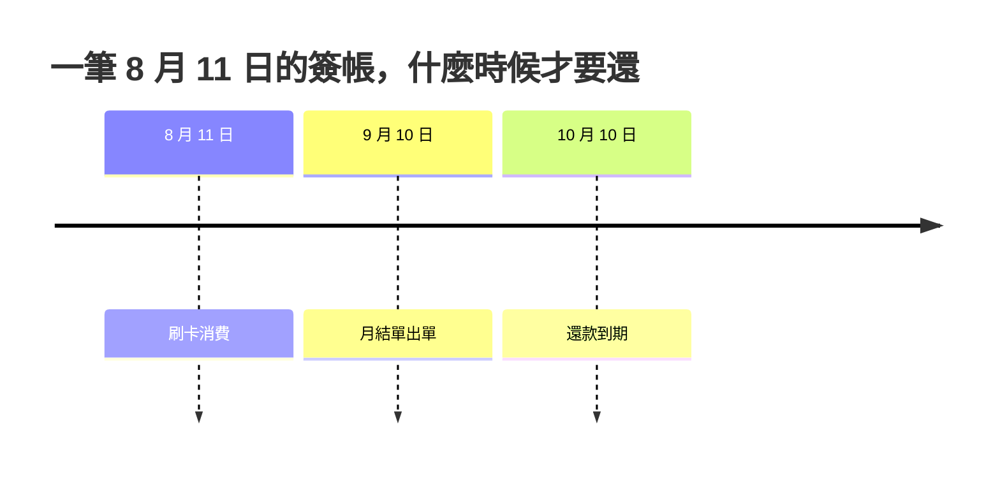

我現在是大學生，手上有五張信用卡。

這篇分兩半：前半講這五張卡各自負責什麼、為什麼要分這麼多張；後半講一件我覺得所有新生都應該先知道的事——信用卡最可怕的地方不是利息，是那兩個月的時間差。

<!-- more -->

## 五張卡的分工

| 卡 | 負責什麼 | 回贈 | 要注意 |
| --- | --- | --- | --- |
| Hang Seng Travel+ | 外幣簽帳、機場早餐 | 各種外幣簽帳都高 | 每月下限 6000 元 |
| Hang Seng Enjoy | 目前雪藏 | 不吸引 | 與 Travel+ 共用信用額 |
| HSBC Gold | 交學費 | 簽滿 8400 元回 200 RC | 回贈要等三至六個月 |
| AEON Wakuwaku | 網上訂閱 | 網上消費 6% | — |
| Wewa Visa | 日常實體消費 | Apple Pay 4% | 每月下限 1500 元 |

這裡的「下限」是指每月最低簽帳要求，簽不夠就拿不到那個回贈率——不是回贈上限，剛開始看會搞混。

**Hang Seng Travel+**：是一張旅行卡，不同外幣簽帳都有高回贈，但每月下限 6000 元，對學生來說很難達到。我主要拿這張卡，是為了在機場享有 10 元的 Starbucks 套餐（一杯中杯飲品加一個包點）。

**Hang Seng Enjoy**：跟 Travel+ 一起申請的。回贈不吸引，已經被我雪藏。

**HSBC Gold**：PolyU 沒有恒生的大學／大專聯營信用卡，所以學費的回贈只能靠通用卡，例如 HSBC Gold。

**AEON Wakuwaku**：網上消費 6% 回贈，我的網上訂閱（Netflix、Claude 之類）全部走這張。它補上了 Wewa 網上消費不能用 Apple Pay 的缺口。

**Wewa Visa**：Apple Pay 有 4% 回贈，基本上只要商戶收信用卡就等於九六折，很百搭。每月下限 1500 元。

## 同一間銀行申請多張卡，信用額是共用的

這件事我是申請完才知道的。

Travel+ 和 Enjoy 是一起申請的，兩張卡要共用一萬元信用額，結果每張卡實際只有 5000 元可用。

所以在同一間銀行同時申請多張卡之前，先確認一下能不能接受 credit share 這件事。

## 學費的回贈：會到，只是很慢

一個年度分兩個學期，學費按學期交，所以一年要交兩次。

HSBC Gold 簽滿 8400 元回 200 RC。一個 sem 200 RC，兩個 sem 就是 400 RC，一年拿到 400 元回贈（RC 即 RewardCash，這裡按 1 RC 當 1 元計）。

要注意的是**回贈不是簽完馬上入帳**，通常要等三至六個月。所以不用怕沒有回贈，它只是還沒到。

## 真正可怕的地方：那兩個月

前面講的都是好處。現在講可怕之處。

信用卡是以月度計算的，你今天簽帳，下個月才還款。很多人因此覺得自己沒有消費過——因為錢不是馬上從銀包裡消失——於是刷得更衝動。

實際的時間差比你想的更長：

8 月 11 日簽的帳，9 月 10 日才出單，10 月 10 日才要還。中間隔了兩個月。

到要還錢的那天，你連自己買過什麼都已經忘記了。錢就這樣白白沒有了——這才是可怕的地方。

## 所以要記帳

我的建議是養成記帳的習慣，每一筆簽帳都記下來。

這樣做不只是知道自己簽了什麼，更重要的是隨時知道**還剩多少錢可以用**，避免過度消費。

工具用哪個都可以，重點是每筆都記。我自己另外寫過一套[把 Google Sheet 當後端的理財工具](/blog/googlesheet%E7%95%B6%E7%90%86%E8%B2%A1app%E5%BE%8C%E7%AB%AF_20260908/)，有興趣可以看看。
