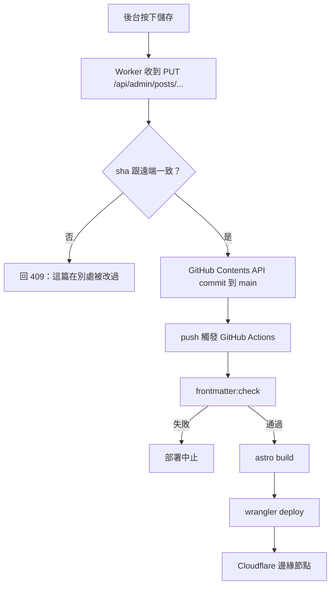

一般部落格的資料流是「後台寫進資料庫，前台從資料庫讀」。這個站沒有資料庫——**文章就是 repo 裡的 Markdown 檔，後台是一個把檔案 commit 回 GitHub 的客戶端**。

這個決定聽起來像偷懶，但它把備份、版本控制、離線編輯、回滾這幾件事一次解決了：`git log` 就是完整的修改史，`git revert` 就是回滾。代價是寫入延遲從毫秒變成一次 CI 建置。

這篇記錄幾個真正花掉時間的設計，還有三個只有在真的部署過才會遇到的坑。

<!-- more -->

## 存一篇文章會發生什麼事



整個後端是 13 個 TypeScript 檔、約 1800 行，跑在一個 Cloudflare Worker 上。後台前端是 1450 行的原生 JavaScript，沒有框架、沒有打包步驟——它就放在 `public/admin/`，跟著靜態資源一起被送出去。

Worker 的分派邏輯只有一句話值得看：

```ts
if (!url.pathname.startsWith('/api/')) {
  return env.ASSETS.fetch(request);
}
```

不是 API 的，全部交給靜態資源。所以整個網站的閱讀路徑上**沒有任何我寫的程式碼在跑**，快取和分發都是 Cloudflare 的事。Worker 只在後台操作和瀏覽計數的時候醒過來。

## 併發：後台不會默默蓋掉你

我常常兩個分頁都開著後台。GitHub 的 Contents API 剛好提供了解法——每個檔案都有 `sha`，更新時把你讀到的那個 `sha` 一起送上去：

```ts
const current = await getFile(ref, path);
if (payload.sha && payload.sha !== current.sha) {
  throw new HttpError(409, '這篇文章在別處被改過了，請重新載入後再儲存，以免覆蓋別人的修改。');
}
```

這是樂觀鎖，而且我不用自己實作——版本戳是 GitHub 本來就給的。

CI 那邊還有一層：

```yaml
concurrency:
  group: deploy-main
  cancel-in-progress: true
```

連續存三次，前兩次的部署會被取消，只有最後一次真的上線。沒有這行的話，三個 build 會互相打架，最後上線的不保證是最新的那份。

## 同一個序列化器，我寫了兩次

這是整個專案裡最反直覺的決定。

`scripts/normalize-frontmatter.mjs` 是建置期的 Node 腳本，會把每篇文章的 frontmatter 用固定格式重新序列化。`worker/lib/frontmatter.ts` 是 Worker 裡的 TypeScript，後台存檔時用它產生檔案內容。

**兩者的輸出必須逐位元組相同。** 檔案裡直接寫了這件事：

```ts
/**
 * The serialized output intentionally matches `scripts/normalize-frontmatter.mjs`
 * byte for byte, so posts written from the admin keep `npm run frontmatter:check`
 * green and never show up as spurious diffs.
 */
```

為什麼不共用一份？因為兩邊的執行環境不一樣：建置腳本可以 `require('yaml')` 這種完整的解析器，Worker 要跑在邊緣節點上，我不想為了讀七個欄位的扁平 YAML 背一個解析器進去。所以 Worker 那份是刻意寫小的，只認這個 collection 允許的形狀，遇到別的就直接拒絕而不是猜。

代價很明確：改序列化格式時要記得改兩個地方。但這個代價是**看得見**的（CI 會紅），而共用一份的代價是把一個完整的 YAML 解析器塞進每一個請求的冷啟動時間裡。

## CI 是契約的執法者

frontmatter 的規則本身是 zod schema：

```ts
if (!data.draft && data.categories.length !== 1) {
	context.addIssue({
		code: 'custom',
		path: ['categories'],
		message: '正式文章必須且只能有一個分類',
	});
}
```

草稿可以沒有分類和標籤，正式文章不行——寫到一半的東西不該被還沒想好的分類卡住。

但真正在把關的是那個 normalize 腳本。它不只驗證，它**重新產生**整個檔案，然後跟原檔比對：

```js
if (source.replace(/^\uFEFF/, '') !== nextSource) {
  report.changedFiles.push(relativePath);
}
```

差一個位元組就算失敗。所以「欄位順序」「引號風格」「陣列縮排」這些平常靠自律的事情，全部變成 CI 會擋的硬規則。

裡面還有一段我覺得最值得抄的設計——重新序列化之後，它會確認**內文一個字都沒變**：

```js
const currentBodyHash = hash(frontmatter.body);
const nextBody = findFrontmatter(nextSource, relativePath).body;

if (hash(nextBody) !== currentBodyHash) {
  throw new Error(`${relativePath}: body hash changed`);
}
```

一個「自動修 frontmatter」的工具，最可怕的失敗不是修錯 frontmatter，是把正文吃掉。這個雜湊比對讓那件事變成不可能發生，而不是「應該不會發生」。

## 三個真的部署過才會遇到的坑

### 一、Astro 會把 slug 轉小寫，而 macOS 幫你把問題藏起來

檔名叫 `GoogleSheet當理財App後端_20260908.md`，產生的網址是 `/blog/googlesheet當理財app後端_20260908/`——連 `App` 都變成 `app`。

我照檔名寫了一條站內連結，在本機測完全正常。因為 **macOS 的檔案系統不分大小寫**，而 Cloudflare 的靜態資源分。這種 bug 在本機是測不出來的，只能上線之後 404。

解法是讓檔名和 slug 一致：ASCII 部分一律小寫。順便學到一件事——驗證站內連結不能用「檔案存不存在」，要拿 sitemap 當權威來源比對。

### 二、只 deploy 不 commit，下一次 CI 會默默還原

我改了首頁的背景圖，用 `wrangler deploy` 推上去，看起來好了。

幾小時後在後台改了一個設定，那個動作 commit 到 main、觸發 CI，CI 從 git 重新建置——背景圖變回舊的。因為我的改動從來沒進過版控。

在「push 就是部署」的架構裡，**git 才是唯一的事實來源**。手動 deploy 只是把一份不在 git 裡的東西暫時放上去，下一次任何人碰到 repo 都會把它擦掉。

### 三、加了自訂網域，workers.dev 會被默默關掉

在 `wrangler.jsonc` 加 `routes` 之後，wrangler 印了一行警告就把 workers.dev 網址停用了，因為設定檔裡沒有明確寫 `workers_dev`。原本的網址直接變成 404。

現在那行是明寫的：

```jsonc
// 只留自訂網域；workers.dev 網址刻意關閉，避免同一份內容有兩個入口。
"workers_dev": false,
```

值跟預設行為一樣，但它現在是一個決定，不是一個副作用。

## 唯一一個真的需要儲存的功能

文章、設定、圖片全都是 repo 裡的檔案，只有瀏覽計數不行——它每次造訪都要變，不可能每次都開一個 commit。

這是整個站唯一用到 Cloudflare KV 的地方，也是唯一不需要登入的 API 端點：

```ts
// 公開端點：文章瀏覽計數。讀者沒有登入，所以要擋在 admin 檢查之前。
if (url.pathname === VIEWS_PATH) {
  return await routeViews(request, env, url);
}
```

因為公開，slug 是信任邊界，會直接變成 KV 的 key，所以先驗形狀才用。KV 沒有原子遞增，同時進來的兩個請求會少算一次；免費方案每天一千次寫入，等於每天一千次瀏覽封頂。兩個限制都寫在註解裡，真的撞到再換 Durable Object。

## 刻意不做的事

**沒有留言系統。** 要嘛自己存（就得有真的資料庫，整個「repo 就是資料庫」的前提就沒了），要嘛掛第三方（就要把讀者的瀏覽行為送給別人）。

**後台沒有做「跟正式站一模一樣」的預覽。** 真正的渲染是 Astro 的 remark/rehype 管線加上 shiki，要在瀏覽器裡完整重現等於把整條管線搬過去。後台的即時預覽只求看得出結構，正式的長相靠 `npm run dev`。

**沒有草稿分享連結。** 草稿在 `draft: true` 時只有本機看得到，正式站直接濾掉。想給人看就先發佈。

---

回頭看，這個架構真正的好處不是省錢（雖然它確實是零月費），而是**它沒有一個「只存在於某台機器上」的狀態**。整個網站——文章、設定、樣式、部署流程——都在 repo 裡。把 repo clone 下來，`npm ci && npm run build`，就是一模一樣的站。

唯一的例外是那個瀏覽計數。而那也是它唯一一個我需要另外備份的東西。
